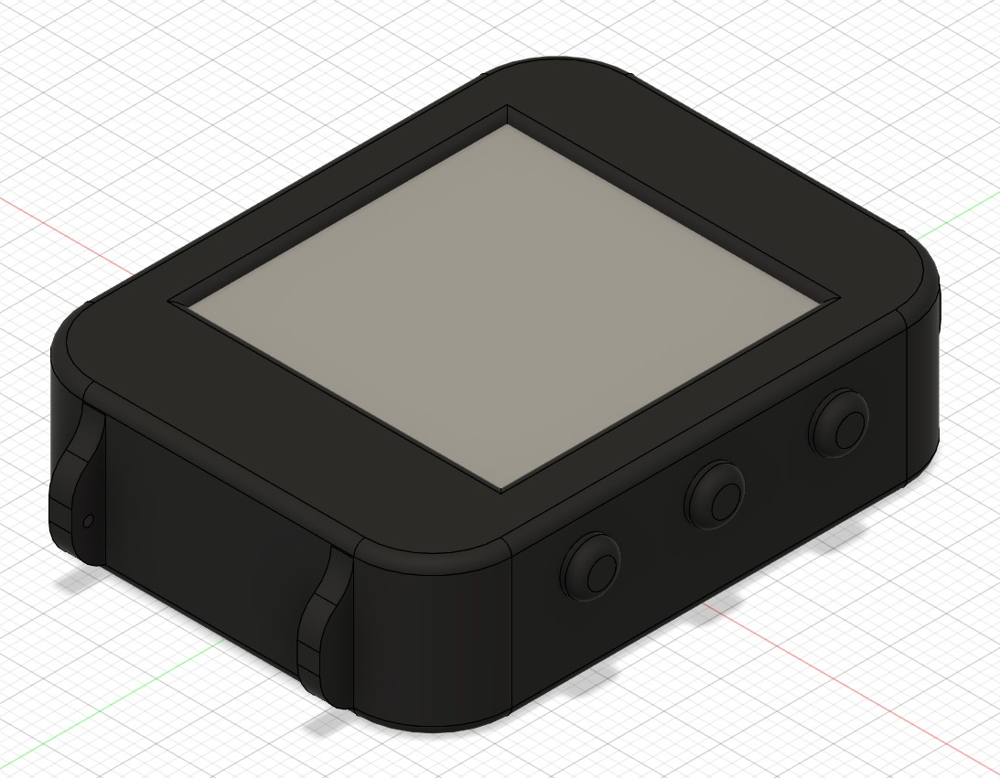
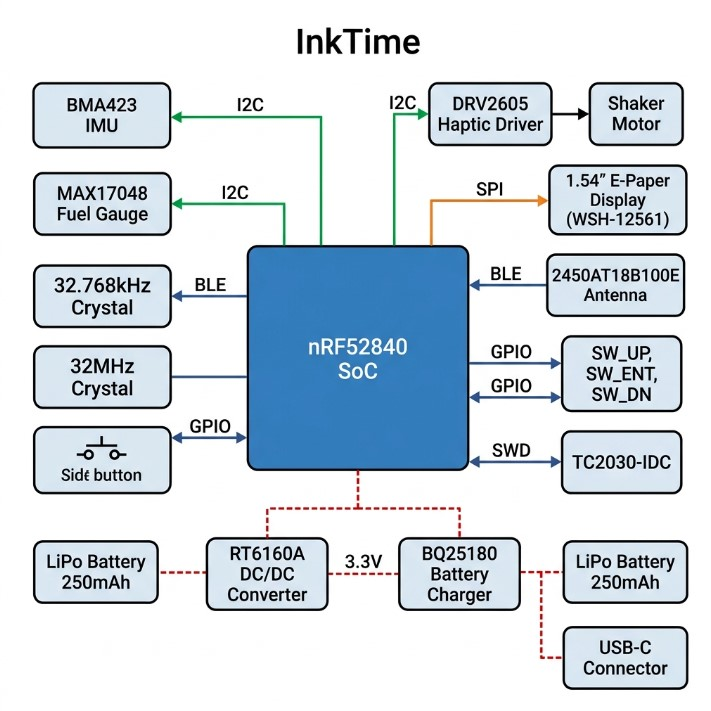
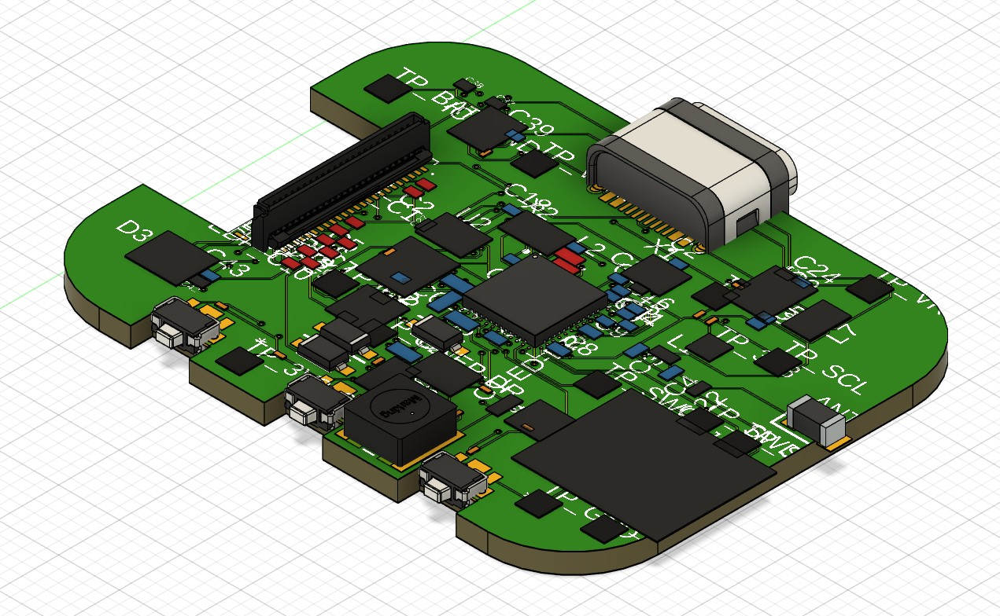
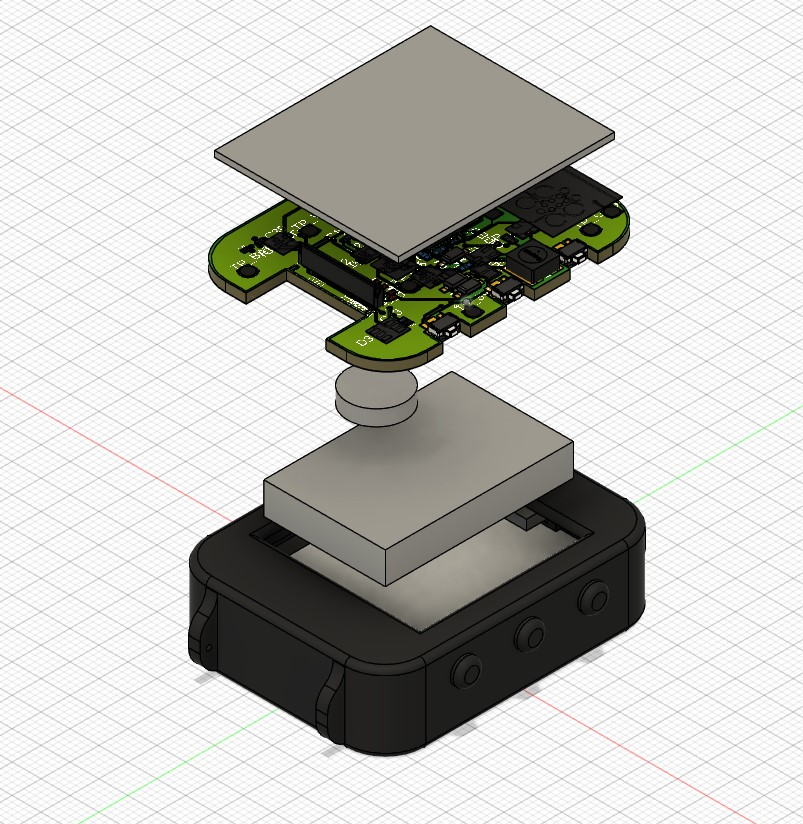
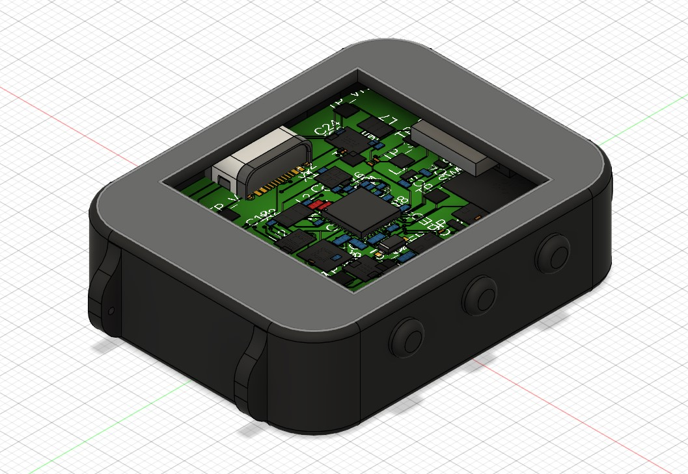

# InkTime v6 - Smartwatch Open Hardware cu E-Paper



InkTime v6 este un proiect hardware open-source de smartwatch bazat pe nRF52840, optimizat pentru consum redus, autonomie mare si integrare mecanica compacta. Documentatia de mai jos este structurata pentru review tehnic si include arhitectura sistemului, BOM, maparea pinilor, analiza de consum si observatii de design.

## Cuprins

- [Diagrama bloc](#diagrama-bloc)
- [Bill of Materials (BOM)](#bill-of-materials-bom)
- [Functionalitate hardware detaliata](#functionalitate-hardware-detaliata)
- [Maparea pinilor nRF52840](#maparea-pinilor-nrf52840)
- [Analiza consumului de energie](#analiza-consumului-de-energie)
- [Design PCB si integrare mecanica](#design-pcb-si-integrare-mecanica)
- [Design log si observatii pentru review](#design-log-si-observatii-pentru-review)
- [Structura repository-ului](#structura-repository-ului)
- [Licenta](#licenta)

## Diagrama bloc

Diagrama bloc este prezentata ca imagine:



Flux de functionare:

1. USB-C alimenteaza incarcatorul BQ25180 si bateria LiPo.
2. Din baterie se genereaza rail-ul de 3.3V (RT6160A), comutat catre sarcina prin PMOS.
3. nRF52840 colecteaza date de la IMU/fuel gauge si controleaza display-ul prin SPI.
4. Pentru notificari locale, nRF52840 activeaza DRV2605 care comanda motorul haptic.
5. BLE asigura schimb de date si configurare cu telefonul.

## Bill of Materials (BOM)

Tabelul de mai jos acopera componentele principale. Pentru pasivele individuale, consultati schema si listele de asamblare exportate din CAD.

| #   | Ref  | Componenta              | Cod / Valoare     | JLC Parts                                                                                                 | Datasheet                                                                                                        |
| --- | ---- | ----------------------- | ----------------- | --------------------------------------------------------------------------------------------------------- | ---------------------------------------------------------------------------------------------------------------- |
| 1   | U1   | MCU BLE                 | nRF52840-QIAA     | [C190794](https://jlcpcb.com/parts/componentSearch?isSearch=true&searchTxt=nRF52840)                      | [nRF52840 PS](https://infocenter.nordicsemi.com/pdf/nRF52840_PS_v1.8.pdf)                                        |
| 2   | IC2  | Li-Ion Charger          | BQ25180YBGR       | [C2682092](https://jlcpcb.com/parts/componentSearch?isSearch=true&searchTxt=BQ25180)                      | [TI BQ25180](https://www.ti.com/lit/ds/symlink/bq25180.pdf)                                                      |
| 3   | IC9  | Buck DC/DC              | RT6160AWSC        | [C2828036](https://jlcpcb.com/parts/componentSearch?isSearch=true&searchTxt=RT6160A)                      | [Richtek RT6160A](https://www.richtek.com/assets/product_file/RT6160A/DS6160A-05.pdf)                            |
| 4   | U3   | Fuel Gauge              | MAX17048G+T10     | [C2682766](https://jlcpcb.com/parts/componentSearch?isSearch=true&searchTxt=MAX17048)                     | [MAX17048/49](https://datasheets.maximintegrated.com/en/ds/MAX17048-MAX17049.pdf)                                |
| 5   | IC3  | IMU                     | BMA423            | [C2831316](https://jlcpcb.com/parts/componentSearch?isSearch=true&searchTxt=BMA423)                       | [Bosch BMA423](https://www.bosch-sensortec.com/products/motion-sensors/accelerometers/bma423/)                   |
| 6   | IC1  | Driver haptic           | DRV2605YZFR       | [C527680](https://jlcpcb.com/parts/componentSearch?isSearch=true&searchTxt=DRV2605)                       | [TI DRV2605](https://www.ti.com/lit/ds/symlink/drv2605.pdf)                                                      |
| 7   | D1   | Protectie ESD USB       | USBLC6-2SC6Y      | [C7519](https://jlcpcb.com/parts/componentSearch?isSearch=true&searchTxt=USBLC6-2SC6Y)                    | [ST USBLC6-2](https://www.st.com/resource/en/datasheet/usblc6-2.pdf)                                             |
| 8   | Q1   | PMOS load switch        | DMG2305UX-7       | [C150812](https://jlcpcb.com/parts/componentSearch?isSearch=true&searchTxt=DMG2305UX)                     | [DMG2305UX](https://www.diodes.com/assets/Datasheets/DMG2305UX.pdf)                                              |
| 9   | Q3   | N-MOS (motor/periferic) | SI1308EDL-T1-GE3  | [C515086](https://jlcpcb.com/parts/componentSearch?isSearch=true&searchTxt=SI1308EDL)                     | [SI1308EDL](https://www.vishay.com/docs/68743/si1308edl.pdf)                                                     |
| 10  | J1   | FPC conector EPD        | 503480-2400 (24p) | [C585393](https://jlcpcb.com/parts/componentSearch?isSearch=true&searchTxt=503480-2400)                   | [Molex 503480](https://www.molex.com/pdm_docs/sd/5034802400_sd.pdf)                                              |
| 11  | J4   | USB-C conector          | KH-TYPE-C-16P     | [C2765186](https://jlcpcb.com/parts/componentSearch?isSearch=true&searchTxt=KH-TYPE-C-16P)                | [USB Type-C Spec](https://www.usb.org/document-library/usb-type-cr-cable-and-connector-specification-release-22) |
| 12  | ANT1 | Antena chip 2.4GHz      | 2450AT18B100E     | [Search JLC](https://jlcpcb.com/parts/componentSearch?isSearch=true&searchTxt=2450AT18B100E)              | [Johanson 2450AT18B100E](https://www.johansontechnology.com/datasheets/2450AT18B100E.pdf)                        |
| 13  | J2   | Header debug            | TC2030-IDC        | [Search JLC](https://jlcpcb.com/parts/componentSearch?isSearch=true&searchTxt=TC2030)                     | [Tag-Connect TC2030](https://www.tag-connect.com/wp-content/uploads/bsk-pdf-manager/TC2030-IDC-NL-10_NL_1.pdf)   |
| 14  | X1   | Cristal HF              | 32MHz             | [Search JLC](https://jlcpcb.com/parts/componentSearch?isSearch=true&searchTxt=32MHz%20crystal%202016)     | [Exemplu 32MHz](https://www.ecsxtal.com/store/pdf/ECS-160-12-33Q.pdf)                                            |
| 15  | X2   | Cristal LF              | 32.768kHz         | [Search JLC](https://jlcpcb.com/parts/componentSearch?isSearch=true&searchTxt=32.768kHz%20crystal%203215) | [Exemplu 32.768kHz](https://www.abracon.com/Resonators/ABS07.pdf)                                                |

## Functionalitate hardware detaliata

### 1) Procesare si conectivitate - nRF52840

- CPU: ARM Cortex-M4F @ 64MHz
- Memorie: 1MB Flash, 256KB RAM
- Radio: BLE 5.x la 2.4GHz
- Interfete folosite in proiect: SPI, I2C, GPIO, USB FS, SWD

Rol functional:

- ruleaza logica aplicatiei si machine-state-ul ceasului
- centralizeaza datele de la senzori
- controleaza secventa de refresh pentru e-paper
- gestioneaza notificari BLE si feedback haptic

### 2) Display e-paper (1.54") + etaj driver

Display-ul e-paper este comandat pe SPI, cu semnale separate de control (`DC`, `RST`, `BUSY`, `CS`). Avantajul major este consumul aproape zero in stare statica; energia se consuma aproape exclusiv la refresh.

Interfata:

- SPI pentru payload grafic
- GPIO pentru sincronizare/stare (`BUSY`) si comenzi

### 3) IMU BMA423

IMU-ul este conectat pe I2C si utilizat pentru:

- step counting
- wake-on-motion / wrist raise
- detectie evenimente contextuale

Poate genera intreruperi catre MCU pentru reducerea polling-ului si optimizare de consum.

### 4) Management baterie - BQ25180 + MAX17048 + RT6160A

- BQ25180: incarcare LiPo din VBUS (USB-C)
- MAX17048: monitorizare starea bateriei (SOC, tensiune)
- RT6160A: conversie stabila catre 3.3V pentru sistem

Acest lant permite operare corecta atat pe USB, cat si pe baterie, cu telemetrie energetica pentru estimarea autonomiei.

### 5) Haptic - DRV2605 + motor

DRV2605 genereaza profile haptice controlate de MCU (I2C + trigger), iar etajul de putere comuta motorul pentru feedback la notificari, alarme si interactiuni UI.

### 6) USB-C, protectie ESD si debug

- USB-C ofera VBUS pentru incarcare si (optional) date USB FS.
- USBLC6-2 reduce riscul de defect la descarcari electrostatice pe D+/D-.
- Header-ul TC2030 expune SWD pentru flash/debug si test de productie.

## Maparea pinilor nRF52840

Maparea de mai jos este cea utilizata in schema proiectului pentru functiile principale.

| Pin nRF52840  | Semnal / Componenta | Interfata | Directie | Motiv alegere                          |
| ------------- | ------------------- | --------- | -------- | -------------------------------------- |
| P0.02         | EPD_SCK             | SPI       | Out      | Clock stabil pentru transfer display   |
| P0.03         | EPD_MOSI            | SPI       | Out      | Date catre e-paper                     |
| P0.28         | EPD_MISO            | SPI       | In       | Citire status/date display             |
| P0.29         | EPD_CS              | GPIO/SPI  | Out      | Selectie dispozitiv e-paper            |
| P0.04         | EPD_DC              | GPIO      | Out      | Selectie data/comanda                  |
| P0.05         | EPD_RST             | GPIO      | Out      | Reset hardware display                 |
| P0.06         | EPD_BUSY            | GPIO      | In       | Sincronizare pe stare busy             |
| P0.26         | I2C_SDA             | I2C       | I/O      | Magistrala comuna senzori/power        |
| P0.27         | I2C_SCL             | I2C       | Out      | Clock I2C comun                        |
| P0.13         | SW_UP               | GPIO IRQ  | In       | Buton up, interrupt la apasare         |
| P0.14         | SW_ENT              | GPIO IRQ  | In       | Buton enter, UI action                 |
| P0.15         | SW_DN               | GPIO IRQ  | In       | Buton down, navigare                   |
| P0.18         | USB_D-              | USB FS    | I/O      | Linie USB dedicata (minus)             |
| P0.20         | USB_D+              | USB FS    | I/O      | Linie USB dedicata (plus)              |
| P0.00 / P0.01 | XL1 / XL2           | LFCLK     | I/O      | Cristal 32.768kHz pentru RTC low-power |
| XC1 / XC2     | X1 32MHz            | HFCLK     | I/O      | Ceas principal CPU/RF                  |
| SWDIO         | SWD_DATA            | SWD       | I/O      | Programare si debugging                |
| SWDCLK        | SWD_CLK             | SWD       | In       | Ceas SWD                               |
| SWO           | SWO_TRACE           | SWD       | Out      | Trace/telemetrie debug                 |
| ANT           | Antena BLE          | RF        | Out      | Iesire RF catre retea de matching      |

Rationale general pentru mapare:

1. SPI-ul display-ului este grupat compact pentru rutare scurta si integritate buna a semnalelor.
2. Toate perifericele lente (IMU, fuel gauge, haptic) sunt pe I2C comun pentru economie de pini.
3. Butoanele sunt pe GPIO-uri configurabile cu intreruperi, pentru wake-up din low power.
4. USB foloseste pinii dedicati ai MCU pentru compatibilitate fizica si software.

## Analiza consumului de energie

Estimare orientativa pe scenariu "smartwatch normal" (ecran actualizat periodic, BLE advertising, wake pe evenimente):

| Bloc                 | Curent activ | Curent sleep/idle | Duty cycle estimat | Curent mediu |
| -------------------- | -----------: | ----------------: | -----------------: | -----------: |
| nRF52840 (CPU + BLE) |  3.2mA-4.8mA |             1.5uA |               5-6% |       ~210uA |
| E-Paper (refresh)    |        ~15mA |       ~0uA static |               0.5% |        ~75uA |
| BMA423               |       ~150uA |             ~14uA |          10% activ |        ~28uA |
| MAX17048             |         23uA |              23uA |               100% |         23uA |
| DRV2605 + motor      |   ~50mA varf |           ~0.25uA |               0.1% |        ~50uA |
| RT6160A quiescent    |            - |             ~25uA |               100% |         25uA |
| **Total estimat**    |            - |                 - |                  - |   **~410uA** |

Pentru baterie de 250mAh:

- autonomie teoretica: `250mAh / 0.41mA = ~609h` (~25 zile)
- cu profil agresiv de sleep si refresh rar: 30-40+ zile (in functie de firmware si trafic BLE)

## Design PCB si integrare mecanica

### PCB



- layout realizat in fisierele `Hardware/project-tsc.sch` si `Hardware/project-tsc-2d-pcb.brd`
- topologia include zona RF dedicata, sectiune alimentare separata si trasee de semnal scurte catre conectorul EPD
- protectie ESD pe USB si puncte de test pentru bring-up

### Integrare mecanica




- modele 3D disponibile in `Mechanical/InkTime3D.f3z` si `Mechanical/InkTime3D.step`
- verificari importante: inaltime baterie, spatiu FPC display, pozitie butoane laterale, clearance pentru motorul haptic

## Design log si observatii pentru review

Design log (sintetic):

1. Definire arhitectura (MCU, putere, senzori, afisaj)
2. Captura schema si validare ERC
3. Placement cu prioritizare RF/power/display
4. Routing + optimizari DRC/ground return
5. Export productie si validare mecanica 3D

Observatii utile pentru review:

- verificati zona antenei: keepout de cupru sub antenna + matching network conform recomandari vendor
- confirmati polaritatea pentru bateria LiPo si sensul diodei Schottky
- verificati secventa de power-up EPD in firmware, pentru a evita refresh instabil
- recomandat test incremental: power rail -> SWD -> I2C -> EPD -> BLE

## Structura repository-ului

```text
inktime-tsc/
|- Hardware/
|  |- project-tsc.sch
|  |- project-tsc-2d-pcb.brd
|- Images/
|  |- 3dpcb.jpg
|  |- inktime-full-watch.jpg
|  |- inktime-3d-expanded-view.jpg
|  |- inktime-watch-no-screen.jpg
|- Manufacturing/
|  |- inktime_gerber.zip
|- Mechanical/
|  |- InkTime3D.f3z
|  |- InkTime3D.step
|- LICENSE
|- README.md
```

## Licenta

Proiectul este distribuit conform fisierului `LICENSE` din acest repository.
